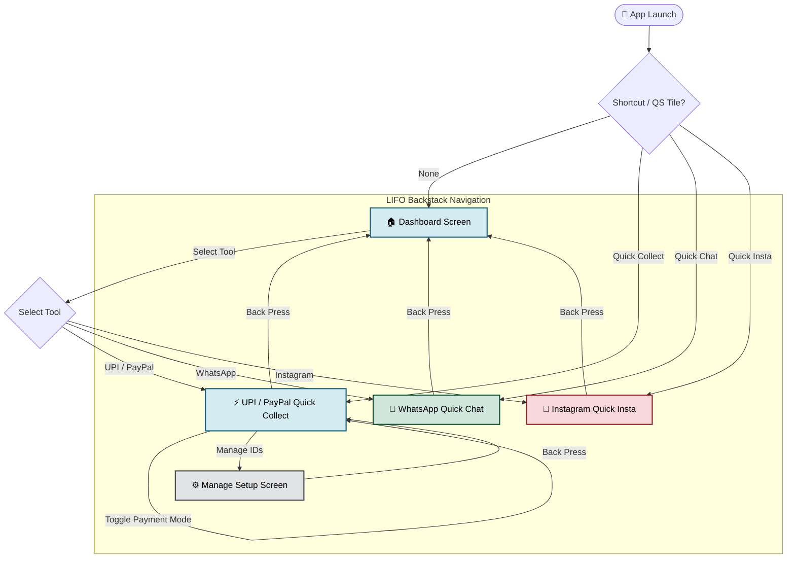

<!-- Banner Header -->

  

<h1 align="center">PocketOps</h1>

  <strong>Stop fumbling. Start executing.</strong>

  
  
  
  

  PocketOps is a sleek, unified, offline-first utility dashboard for Android. Built with Jetpack Compose following Material 3 Expressive guidelines, it gives you instant micro-actions directly from your launcher screen, homescreen widget, or quick settings drawer.

---

## 📱 Screenshots

| Menu | Quick UPI | Quick UPI QR |
|:----:|:---------:|:------------:|
|  |  |  |
| **Quick Chat** | **Quick Insta** | |
|  |  | |

---

## 🗺️ Application Navigation Flow

---

## 🚀 Key Features

*   **⚡ Quick Collect (UPI / PayPal)**
    *   Generate dynamic or static payment QR codes locally.
    *   Smart recent-amount chips for fast inputs.
    *   **Auto-brightness boost** to 100% while showing the QR code for instant scanner detection (restores previous brightness on close).
    *   Supports saving, managing, and switching between multiple payment IDs.
*   **💬 Quick Chat**
    *   Start chat windows directly with any phone number without saving it to your contacts list.
*   **📸 Quick Insta**
    *   Type an Instagram username (auto-cleans leading `@` symbols) and open their profile directly in the official app or browser, or use Direct Search.
*   **⚙️ System Integrations**
    *   *Quick Settings Tile*: Access the PocketOps utility drawer instantly from anywhere.
    *   *Launcher Shortcuts*: Long-press the launcher icon to jump straight into UPI, Chat, or Instagram.

---

## 🎨 Expressive Theme System

PocketOps adapts contextually to your workflow. The entire interface shifts its color palette depending on which tool is active:
*   🟢 **Emerald Green Theme**: Activates when Quick Chat is selected.
*   🌸 **Expressive Pink Theme**: Activates when Quick Instagram is selected.
*   🔹 **Dynamic Blue Theme**: Activates when Quick UPI is selected.
*   🎨 **Device Theme-Aware**: Fully follows your system's Light/Dark mode settings.

---

## 🛠️ Tech Stack & Architecture

- **Language:** Kotlin
- **UI Framework:** Jetpack Compose (Material 3 Expressive Design)
- **Data Persistence:** Jetpack DataStore (Preferences)
- **Widgets:** Jetpack Glance (Material 3 Widget support)
- **QR Generation:** Local offline generation via ZXing library
- **Routing:** Custom LIFO `navigationStack` backstack manager with state-aware toggle routing

---

## 🔧 Getting Started

1. Clone or open the project in **Android Studio**.
2. Select **`jbr-21`** (Bundled JDK 21) in your project structure settings.
3. Sync Gradle and run the app on your device.

---

## 📜 License Quick Reference

This project is licensed under the [PocketOps Custom Open Source License](LICENSE). It is source-available for personal use and inspection, but enforces strict distribution rights.

| Permissions | Requirements | Restrictions |
| :--- | :--- | :--- |
| 🟢 **Local Modification** Modify, test, and use the code locally on any personal device. | 🟡 **Authorship Preservation** Any permitted derivatives must retain original credits to Aakarsh (L192). | 🔴 **No Minor Redistribution** Publishing clones with only minor changes (logo, name, packages) is strictly prohibited. |
| 🟢 **Original Share** Redistribute original code using the same name, logo, and package ID. | 🟡 **Forced Open Source** Permitted forks (≥30% changes) **must** remain open-source under this same license. | 🔴 **No Proprietary Derivatives** You cannot close the source code of any modified versions. |

> [!IMPORTANT]
> To request custom exceptions or commercial licensing terms, you must request and obtain permission via email exclusively at **192aakarsh@gmail.com**.

*Maintained with ❤️ by **Aakarsh (L192)***.
